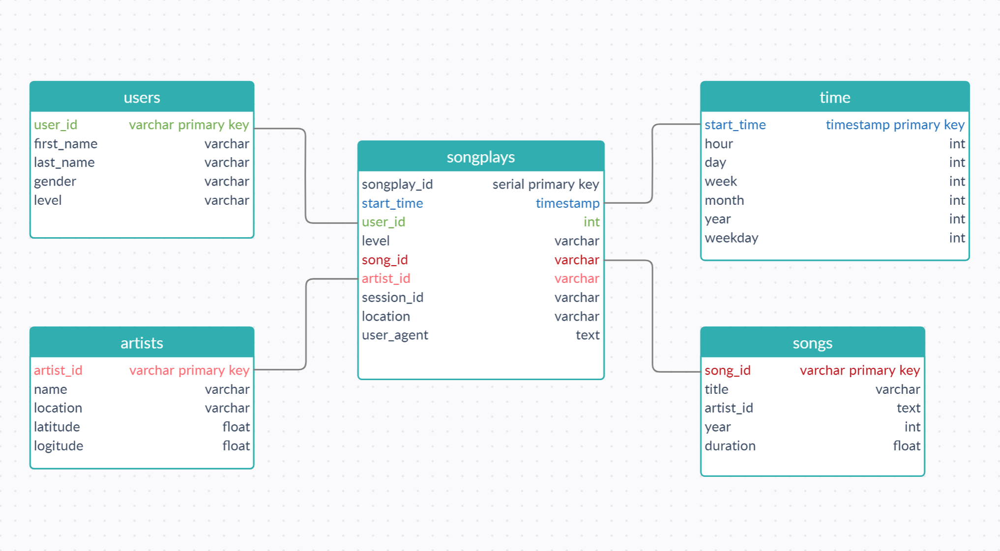

# Data pipeline with Apache Airflow project

<br>
<br>

## **Project introduction**

<br>

A music streaming company, Sparkify, has decided that it is time to introduce more automation and monitoring to their data warehouse ETL pipelines and come to the conclusion that the best tool to achieve this is Apache Airflow.

They have decided to create high grade data pipelines that are dynamic and built from reusable tasks, can be monitored, and allow easy backfills. They have also emphasized that the data quality plays a big part when analyses are executed on top the data warehouse and want to run tests against their datasets after the ETL steps have been executed to catch any discrepancies in the datasets.

The source data resides in S3 and will be processed in Sparkify's data warehouse in Amazon Redshift. The source datasets consist of JSON logs that tell about user activity in the application and JSON metadata about the songs the users listen to.

<br>
<br>

## **Project Datasets**

<br>

### Song Dataset  
The first dataset is a subset of real data from the Million Song Dataset. Each file is in JSON format and contains metadata about a song and the artist of that song. The files are partitioned by the first three letters of each song's track ID. For example, here are filepaths to two files in this dataset.
```
song_data/A/B/C/TRABCEI128F424C983.json
song_data/A/A/B/TRAABJL12903CDCF1A.json
```
And below is an example of what a single song file, TRAABJL12903CDCF1A.json, looks like.
```json
{"num_songs": 1, "artist_id": "ARJIE2Y1187B994AB7", "artist_latitude": null, "artist_longitude": null, "artist_location": "", "artist_name": "Line Renaud", "song_id": "SOUPIRU12A6D4FA1E1", "title": "Der Kleine Dompfaff", "duration": 152.92036, "year": 0}
```  

<br>

### Log Dataset
The second dataset consists of log files in JSON format generated by this [event simulator](https://github.com/Interana/eventsim) based on the songs in the dataset above. These simulate app activity logs from an imaginary music streaming app based on configuration settings.

The log files in the dataset you'll be working with are partitioned by year and month. For example, here are filepaths to two files in this dataset.
```
log_data/2018/11/2018-11-12-events.json
log_data/2018/11/2018-11-13-events.json
```
And below is an example of what the data in a log file, 2018-11-12-events.json, looks like.


<br>
<br>

## **Database schema**

<br>



<br>
<br>

## **ETL Pipeline (DAG)**

<br>


<br>
<br>

## **Explanation of files in the project**

- `create_tables.sql` contains SQL scripts for creating staging tables and final schema tables.

- `plugins` folder

    - `helpers` folder
        - `__init__.py` imports all sql queries from sql_queries.py file.
        - `sql_queries.py` contains insert sql queries for final schema tables.

    - `operators` folder
        - `__init__.py` imports all operators from their respective files.
        - `data_quality.py` contains a script to conduct data quality checks and log and notify about potential data quality issues.
        - `load_dimension.py` contains a script to make data transformations for final dimension tables.
        - `load_fact.py` contains a script to make data transformations for final fact table.
        - `stage_redshift.py`contains a script to take input JSON formatted files from S3 to Redshift, given the correct AWS credentials.

- `dags` folder
    - `ETL_DAG.py` controls and orchestrates the pipeline flow using scripts mentioned above.